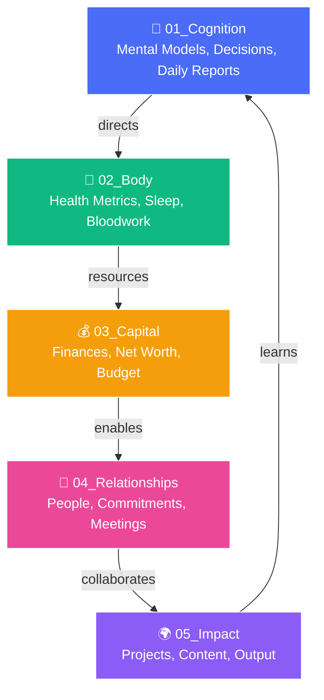
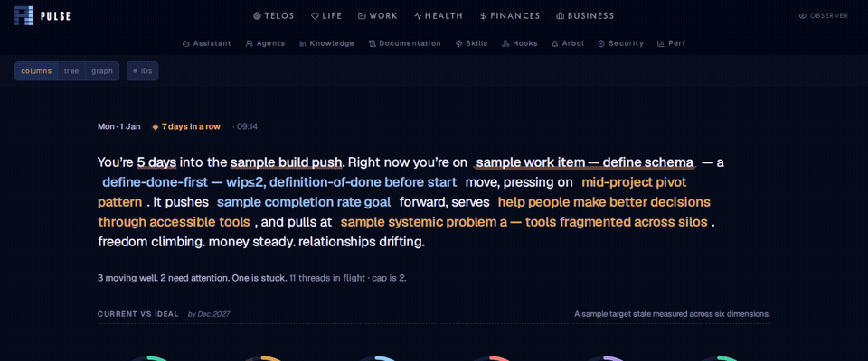
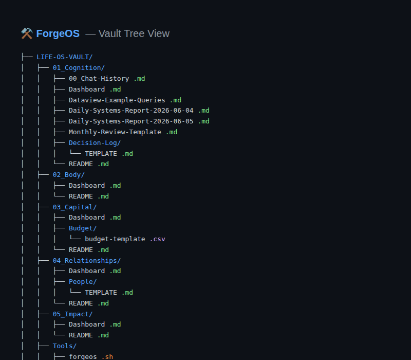

<div align="center">

# ⚒️ ForgeOS

### Fully Local · Systems-Thinking · Personal Operating System

> *One vault. Five life stacks. Powered by PAI + Ollama + Qwen 2.5 7B (CPU-only, 32 GB friendly).*

[](https://ollama.ai)
[]()
[]()
[]()
[]()
[](Tools/test-forgeos.sh)
[]()
[]()
[]()
[](LICENSE)
[](setup.sh)

---

**Explore:** [Why This Exists](#why-this-exists) · [Core Philosophy](#core-philosophy) · [The Five Stacks](#the-five-stacks) · [Quick Install](#quick-install--10-minutes) · [PAI Pulse Dashboard](#-pai-pulse-dashboard) · [The Vault →](LIFE-OS-VAULT/README.md)

---

</div>

## Why This Exists

Most personal knowledge management systems are **dead folders** — they collect notes but never act on them. Most AI tools are **cloud-dependent black boxes** that own your data and thoughts.

**ForgeOS is different.** It's a living, queryable, version-controlled second brain that:

- **Runs entirely offline** — no API keys, no data leaving your machine
- **Thinks in systems** — five interconnected life stacks with feedback loops, not silos
- **Acts on your behalf** — local AI agents (Qwen 2.5 7B / DeepSeek R1 7B via Ollama) ingest your daily reports and suggest next actions
- **Grows with you** — version-controlled via git, queryable via Obsidian Dataview, extensible via the PAI agent framework
- **Visualizes your life** — the PAI Pulse dashboard (localhost:31337) gives you a real-time Goals → Metrics → Projects → Recommendations view

Inspired by [danielmiessler's PAI](https://github.com/danielmiessler/Personal_AI_Infrastructure) and the original *kache* thread, ForgeOS distills the Life Operating System concept into a **one-person, one-machine, one-vault** implementation that anyone can set up in under 10 minutes.

## Core Philosophy

| Principle | Meaning |
|-----------|---------|
| **🔒 Privacy-first, local-only** | Every model runs on your machine via Ollama. Zero cloud dependencies. Your thoughts, health data, finances, relationships, and projects never leave your CPU. |
| **🎯 One agent at a time** | Focus over parallelism. The AI works *with you*, not for a crowd. |
| **🌱 Antifragile** | The system gets stronger with use. Every daily report, decision log, and query makes the vault smarter. |
| **🔄 Systems thinking** | Five interconnected stacks with feedback loops — not silos. Cognition directs body. Body resources capital. Capital enables relationships. Relationships drive impact. Impact feeds back into cognition. |
| **🔍 Queryable by default** | With Obsidian Dataview, every note is a database row. Ask *"what did I weigh when my sleep was best?"* or *"which projects generated the most impact per hour?"* |

## The Five Stacks



| Stack | Layer | What Goes Here |
|:-----:|-------|----------------|
| 🧠 **01_Cognition** | Executive | Daily Systems Reports, decision logs, chat histories, mental models, Dataview queries |
| 💪 **02_Body** | Sensory | Sleep exports (Oura/Whoop), HRV, workouts, biomarker trends |
| 💰 **03_Capital** | Resource | Budget CSVs, net worth snapshots, investment allocations |
| 🤝 **04_Relationships** | Social | Per-person notes, 1:1 logs, promises made, annual reviews |
| 🌍 **05_Impact** | Actuation | Active/archived projects, open-source, content, ideas |

Each stack feeds the next in a **closed-loop system** — Impact generates lessons that flow back into Cognition.

---

## 🖥️ PAI Pulse Dashboard

ForgeOS includes **PAI Pulse** — a real-time life dashboard served at **`http://localhost:31337`** that visualizes your goals, metrics, projects, budget, team, and recommendations in a single page.

### What it shows

| Section | What you see |
|---------|-------------|
| **🎯 Goals** | KPIs with progress bars per life dimension (creative, money, health, relationships, freedom) |
| **📊 Metrics** | First-class measurements with sparklines — sleep, distance, MRR, focus time, and more |
| **🧩 Challenges & Strategies** | Personal blockers mapped to the strategies that answer them |
| **📋 Projects & Work** | What's moving right now — each work item traces to its strategy and goal |
| **👥 Team** | Humans and agents doing the work, with ownership mapped |
| **💰 Budget** | Money, time, and attention budgets with progress bars |
| **💡 Recommendations** | Next 2-3 moves with traceability back to primitives |

### Start the dashboard

```bash
# 1. Install Bun (if not installed)
curl -fsSL https://bun.sh/install | bash

# 2. Start Pulse
cd ~/.claude/PAI/PULSE && bun run pulse.ts
```

Then open **http://localhost:31337** in your browser.

> **Current status:** Pulse dashboard is running in this Codespace at `localhost:31337` with Observability, Voice, Wiki, Performance, Syslog, and Telegram modules loaded.

---

## Quick Install (<10 minutes)

### Prerequisites
- A computer with **8+ GB RAM** (32 GB recommended for Qwen 2.5 7B)
- **Linux, macOS, or WSL2** on Windows

### Option A: One-shot bootstrap (recommended)
```bash
git clone https://github.com/NullLabTests/ForgeOS.git
cd ForgeOS
./setup.sh        # Installs Ollama + Bun + Pulse + pulls models + starts everything
```

### Option B: Manual step-by-step

#### Step 1: Clone
```bash
git clone https://github.com/NullLabTests/ForgeOS.git
cd ForgeOS
```

#### Step 2: Install Ollama
```bash
curl -fsSL https://ollama.com/install.sh | sh
```

#### Step 3: Pull local LLMs
```bash
ollama pull deepseek-r1:1.5b   # 1.1 GB — fast, daily queries
ollama pull deepseek-r1:7b     # 4.7 GB — full reasoning (optional)
ollama pull nomic-embed-text   # 274 MB — RAG embeddings
```

#### Step 4: Open vault in Obsidian
1. Open Obsidian → **Open folder as vault** → select `LIFE-OS-VAULT/`
2. Install **Dataview** plugin (Community plugins → browse → Dataview → enable)
3. (Recommended) **Periodic Notes**, **Tasks**, **Calendar** plugins

#### Step 5: First daily report
```bash
./forgeos report          # auto-generates today's report
```

#### Step 6: Start everything
```bash
./forgeos start           # Ollama API (:11434) + Pulse Dashboard (:31337)
```

#### Step 7: Verify
```bash
ollama run deepseek-r1:7b "What makes ForgeOS different?"
```

#### Step 8: Ask your vault
```bash
./Tools/ask-vault.sh "What wins did I log this week?"
```

#### Step 9: Chat with the local LLM
Open `LIFE-OS-VAULT/Tools/ollama-webui.html` in any browser:
```bash
./forgeos chat
```

## 🛠️ Tools & Scripts

| Tool | Purpose | Usage |
|------|---------|-------|
| **`./setup.sh`** | One-shot bootstrap installer | `./setup.sh` |
| **`./forgeos`** | One-command CLI — status, start, daily reports, chat | `./forgeos status`, `./forgeos start`, `./forgeos report`, `./forgeos chat` |
| **`./Tools/ask-vault.sh`** | RAG query your vault via Ollama | `./Tools/ask-vault.sh "What are my blockers?"` |
| **`./Tools/test-forgeos.sh`** | Run repo integrity checks | `./Tools/test-forgeos.sh` |
| **`./LIFE-OS-VAULT/01_Cognition/Dataview-Example-Queries.md`** | Ready-to-use Dataview SQL for Obsidian | Open in Obsidian with Dataview enabled |
| **`./LIFE-OS-VAULT/01_Cognition/Decision-Log/TEMPLATE.md`** | Structured decision documentation | Copy, rename, fill |
| **`./LIFE-OS-VAULT/01_Cognition/Monthly-Review-Template.md`** | Monthly reflection across all 5 stacks | Copy, fill end of month |
| **`./LIFE-OS-VAULT/03_Capital/Budget/budget-template.csv`** | Budget tracking CSV template | Import into spreadsheet app |
| **`./LIFE-OS-VAULT/04_Relationships/People/TEMPLATE.md`** | People notes template | Copy per person, fill |

## Current Status

```
⚡ Running Qwen 2.5 7B / DeepSeek R1 7B locally on CPU
🖥️  PAI Pulse dashboard live at localhost:31337
🧠 WebUI ready via PAI interface
📊 Dataview-ready vault with example queries
🔄 Daily Systems Report flow active
📦 All models fit in 32 GB RAM — no GPU required
```

## Using Dataview Queries

Open `LIFE-OS-VAULT/01_Cognition/Dataview-Example-Queries.md` in Obsidian to see live data:

```dataview
TABLE date as "Date", Wins as "Top Win"
FROM "01_Cognition"
WHERE contains(file.name, "Daily-Systems-Report")
SORT date DESC
LIMIT 10
```

## Repository Structure

```
ForgeOS/
├── forgeos                 # ⚡ One-command CLI (status / start / report / chat)
├── setup.sh                # 🚀 One-shot bootstrap installer
├── LIFE-OS-VAULT/          # ⭐ The vault — star of the repo
│   ├── 01_Cognition/       #   Mental models, decisions, daily reports
│   │   ├── Decision-Log/   #   Decision templates & records
│   │   ├── Dataview-Example-Queries.md
│   │   └── Monthly-Review-Template.md
│   ├── 02_Body/            #   Health metrics, sleep, bloodwork
│   ├── 03_Capital/         #   Finances, net worth, budget
│   ├── 04_Relationships/   #   People, commitments, meetings
│   ├── 05_Impact/          #   Projects, content, output
│   └── README.md           #   Vault-specific docs
├── Tools/                  # Utility scripts
│   ├── ask-vault.sh        #   RAG query your vault via Ollama
│   └── validate-protected.ts
├── assets/                 # Diagrams and screenshot placeholders
├── Packs/                  # PAI skill packs (45 skills, 171 workflows)
├── Releases/               # PAI versioned releases (v2.3 → v5.0.0)
├── images/                 # PAI architecture diagrams
├── PLATFORM.md
├── SECURITY.md
└── README.md               # ← You are here
```

## Architecture Diagram

A full Mermaid and ASCII diagram is in [`assets/five-stacks-diagram.md`](assets/five-stacks-diagram.md).

```
┌──────────────────────────────────────────────────────────────┐
│                     FORGEOS — FIVE STACKS                    │
│                    (with feedback loops)                     │
├──────────────────────────────────────────────────────────────┤
│                                                              │
│  01_Cognition  ──────────────────────────────→  02_Body      │
│  (Mental Models,   ←─────────────────────────  (Health,      │
│   Decisions,        Feedback Loop: Learning     Sleep,       │
│   Daily Reports)     informs all stacks        Bloodwork)   │
│       ↑                                                  ↓   │
│       │                 03_Capital                          │
│       │                 (Finances, Budget,                  │
│       │                  Net Worth)                         │
│       │                     ↓                               │
│       │                 04_Relationships                     │
│       │                 (People, Commitments,               │
│       │                  Meetings)                          │
│       │                     ↓                               │
│       └────────── 05_Impact  ←───────────────────────────┘   │
│                  (Projects, Content, Legacy)                │
│                                                              │
│               ┌────────────────────────┐                    │
│               │   AI Layer (Local)    │                    │
│               │  Ollama → Qwen 7B    │                    │
│               │  PAI Pulse Dashboard  │                    │
│               │  Dataview Queries    │                    │
│               └────────┬───────────────┘                    │
│                        ↓                                    │
│               Queries all 5 stacks                          │
│                                                              │
└──────────────────────────────────────────────────────────────┘
```

## Screenshots

| PAI Pulse Dashboard (animated) | Vault Tree View |
|:---:|:---:|
|  |  |
| Scrolling through Goals, Metrics, Projects, Budget, Recommendations | Obsidian vault with 5-stack hierarchy |

## Running Tests

Validate repo integrity at any time with:

```bash
./Tools/test-forgeos.sh
```

The test suite checks: repo structure, vault hierarchy, all 5 stack dashboards, template files, Dataview queries, README references, screenshot assets, git health, and optional Ollama liveness. All checks pass on a clean install.

## License

MIT — see [LICENSE](LICENSE).

---

<div align="center">
Made with ⚒️ by NullLabTests · Powered by <a href="https://ollama.ai">Ollama</a> · <a href="https://qwenlm.github.io">Qwen</a> · <a href="https://obsidian.md">Obsidian</a> · <a href="https://github.com/danielmiessler/Personal_AI_Infrastructure">PAI</a>

<br/>

*Your life is a system. Start treating it like one.*
</div>
