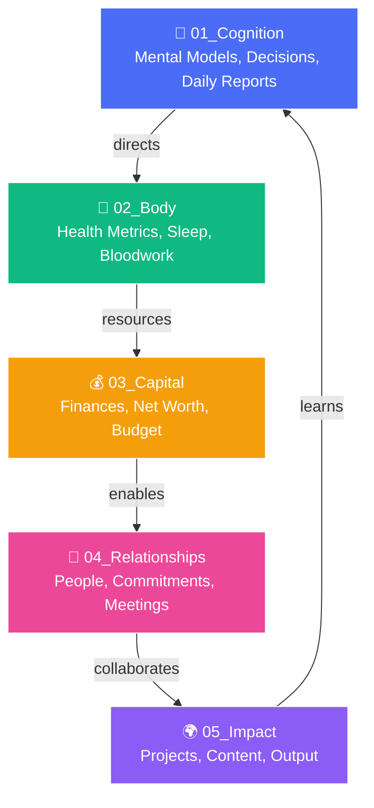

<div align="center">

# ⚒️ ForgeOS

### Fully Local · Systems-Thinking · Personal Operating System

> *One vault. Five life stacks. Powered by PAI + Ollama + Qwen 2.5 7B (CPU-only, 32 GB friendly).*

[](https://ollama.ai)
[]()
[]()
[]()
[]()
[]()
[]()
[]()
[](LICENSE)

---

**Explore:** [Why This Exists](#why-this-exists) · [Core Philosophy](#core-philosophy) · [The Five Stacks](#the-five-stacks) · [Quick Install](#quick-install--10-minutes) · [The Vault →](LIFE-OS-VAULT/README.md)

---

</div>

## Why This Exists

Most personal knowledge management systems are **dead folders** — they collect notes but never act on them. Most AI tools are **cloud-dependent black boxes** that own your data and thoughts.

**ForgeOS is different.** It's a living, queryable, version-controlled second brain that:

- **Runs entirely offline** — no API keys, no data leaving your machine
- **Thinks in systems** — five interconnected life stacks with feedback loops, not silos
- **Acts on your behalf** — local AI agents (Qwen 2.5 7B / DeepSeek R1 7B via Ollama) ingest your daily reports and suggest next actions
- **Grows with you** — version-controlled via git, queryable via Obsidian Dataview, extensible via the PAI agent framework

Inspired by [danielmiessler's PAI](https://github.com/danielmiessler/Personal_AI_Infrastructure) and the original *kache* thread, ForgeOS distills the Life Operating System concept into a **one-person, one-machine, one-vault** implementation that anyone can set up in under 10 minutes.

## Core Philosophy

- **Privacy-first, local-only.** Every model runs on your machine via Ollama. Zero cloud dependencies. Your thoughts, health data, finances, relationships, and projects never leave your CPU.
- **One agent at a time.** Focus over parallelism. The AI works with you, not for a crowd.
- **Antifragile.** The system gets stronger with use. Every daily report, every decision log, every query makes the vault smarter.
- **Systems thinking.** The five stacks are not folders — they are interconnected layers with feedback loops. Cognition directs body. Body resources capital. Capital enables relationships. Relationships drive impact. Impact feeds back into cognition.
- **Queryable by default.** With Obsidian Dataview, every note is a database row. Ask "what did I weigh when my sleep was best?" or "which projects generated the most impact per hour?" — and get answers instantly.

## The Five Stacks



| Stack | Purpose | What Goes Here |
|-------|---------|----------------|
| **01_Cognition** 🧠 | Executive center. Mental models, decisions, daily logs. | Daily Systems Reports, decision logs, chat histories, mental models, Dataview queries |
| **02_Body** 💪 | Sensory layer. Health metrics, sleep, exercise, bloodwork. | Sleep exports (Oura/Whoop), HRV, workouts, biomarker trends |
| **03_Capital** 💰 | Resource layer. Finances, income, expenses, net worth. | Budget CSVs, net worth snapshots, investment allocations |
| **04_Relationships** 🤝 | Social layer. People, commitments, meetings. | Per-person notes, 1:1 logs, promises made, annual reviews |
| **05_Impact** 🌍 | Actuation layer. Projects, output, legacy. | Active/archived projects, open-source, content, ideas |

Each stack feeds the next in a **closed-loop system** — Impact generates lessons that flow back into Cognition.

## Quick Install (<10 minutes)

### Prerequisites
- A computer with **8+ GB RAM** (32 GB recommended for Qwen 2.5 7B)
- **Linux, macOS, or WSL2** on Windows

### Step 1: Clone the vault
```bash
git clone https://github.com/NullLabTests/ForgeOS.git
cd ForgeOS
```

### Step 2: Install Ollama
```bash
curl -fsSL https://ollama.com/install.sh | sh
```

### Step 3: Pull the local LLM
```bash
ollama pull qwen2.5:7b     # 4.7 GB — recommended
# or
ollama pull deepseek-r1:7b # 4.7 GB — also works
```

### Step 4: Open the vault in Obsidian
1. Open Obsidian → **Open folder as vault** → select `LIFE-OS-VAULT/`
2. Install the **Dataview** plugin (Community plugins → browse → Dataview → enable)
3. (Recommended) Install **Periodic Notes**, **Tasks**, **Calendar** plugins

### Step 5: Generate your first Daily Systems Report
```bash
# From the vault root, copy the template:
cp 01_Cognition/Daily-Systems-Report-2026-06-04.md \
   01_Cognition/Daily-Systems-Report-$(date +%Y-%m-%d).md
```
Open in Obsidian, customize, and watch Dataview queries light up.

### Step 6: Verify the AI works
```bash
ollama run qwen2.5:7b "Summarize: ForgeOS is a personal operating system."
```

### Step 7 (optional): Connect PAI agents
[PAI (Personal AI Infrastructure)](https://github.com/danielmiessler/Personal_AI_Infrastructure) is included in this repo. Configure it to use your local Ollama endpoint:

```bash
# PAI auto-detects local Ollama. If needed, set:
export OLLAMA_HOST=http://localhost:11434
```

## Current Status

```
⚡ Running Qwen 2.5 7B locally on CPU
🧠 WebUI ready via PAI interface (localhost:31337)
📊 Dataview-ready vault with example queries
🔄 Daily Systems Report flow active
📦 All models fit in 32 GB RAM — no GPU required
```

## Using Dataview Queries

Open any note in `LIFE-OS-VAULT/01_Cognition/Dataview-Example-Queries.md` in Obsidian to see live data. Example:

```dataview
TABLE date as "Date", Wins as "Top Win"
FROM "01_Cognition"
WHERE contains(file.name, "Daily-Systems-Report")
SORT date DESC
LIMIT 10
```

## Repository Structure

```
ForgeOS/
├── LIFE-OS-VAULT/          # ⭐ The vault — star of the repo
│   ├── 01_Cognition/       #   Mental models, decisions, daily reports
│   ├── 02_Body/            #   Health metrics, sleep, bloodwork
│   ├── 03_Capital/         #   Finances, net worth, budget
│   ├── 04_Relationships/   #   People, commitments, meetings
│   ├── 05_Impact/          #   Projects, content, output
│   └── README.md           #   Vault-specific docs
├── assets/                 # Diagrams and screenshot placeholders
├── Packs/                  # PAI skill packs (45 skills, 171 workflows)
├── Releases/               # PAI versioned releases
├── Tools/                  # Validation and utility scripts
├── images/                 # PAI architecture diagrams
├── PLATFORM.md             # Platform-specific configuration
├── SECURITY.md             # Security policy
└── README.md               # ← You are here
```

## Screenshots

| Vault Tree View | Dataview Dashboard |
|:---:|:---:|
|  |  |
| *(Replace with actual screenshot)* | *(Replace with actual screenshot)* |

## License

MIT — see [LICENSE](LICENSE).

---

<div align="center">
Made with ⚒️ by NullLabTests · Powered by <a href="https://ollama.ai">Ollama</a> · <a href="https://qwenlm.github.io">Qwen</a> · <a href="https://obsidian.md">Obsidian</a> · <a href="https://github.com/danielmiessler/Personal_AI_Infrastructure">PAI</a>

<br/>

*Your life is a system. Start treating it like one.*
</div>
