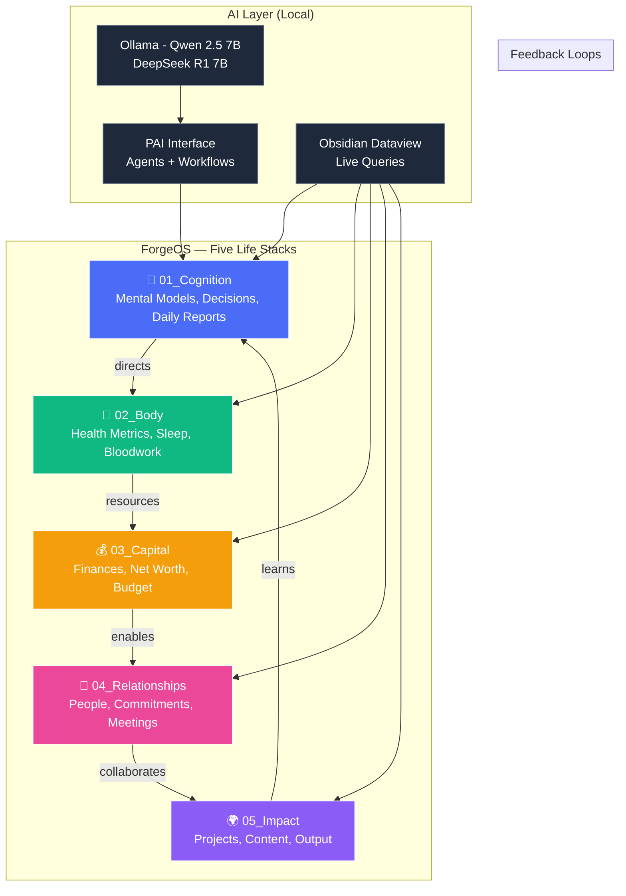

# ForgeOS Five-Stack Architecture Diagram

## Mermaid (renders on GitHub)



## ASCII Art

```
┌──────────────────────────────────────────────────────────────┐
│                     FORGEOS — FIVE STACKS                    │
│                    (with feedback loops)                     │
├──────────────────────────────────────────────────────────────┤
│                                                              │
│  01_Cognition  ──────────────────────────────→  02_Body      │
│  (Mental Models,   ←─────────────────────────  (Health,      │
│   Decisions,        Feedback Loop: Learning     Sleep,       │
│   Daily Reports)     informs all stacks        Bloodwork)   │
│       ↑                                                  ↓   │
│       │                                                  │   │
│       │              03_Capital                           │   │
│       │              (Finances, Budget,                   │   │
│       │               Net Worth)                          │   │
│       │                  ↓                                │   │
│       │              04_Relationships                      │   │
│       │              (People, Commitments,                │   │
│       │               Meetings)                           │   │
│       │                  ↓                                │   │
│       └────────── 05_Impact  ←───────────────────────────┘   │
│                  (Projects, Content,                        │
│                   Legacy)                                   │
│                                                              │
│               ┌────────────────────────┐                    │
│               │   AI Layer (Local)    │                    │
│               │  Ollama → Qwen 7B    │                    │
│               │  PAI Agents          │                    │
│               │  Dataview Queries    │                    │
│               └────────┬───────────────┘                    │
│                        ↓                                    │
│               Queries all 5 stacks                          │
│                                                              │
└──────────────────────────────────────────────────────────────┘
```
